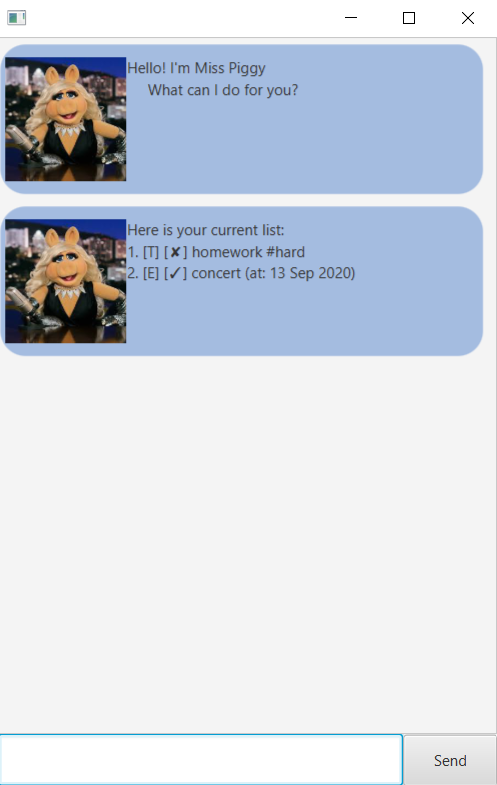
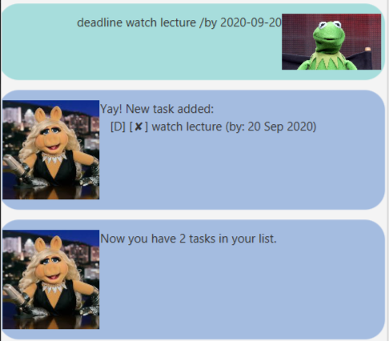
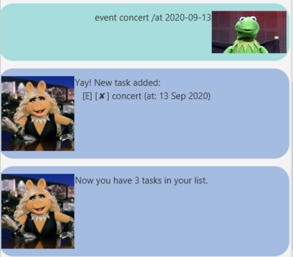
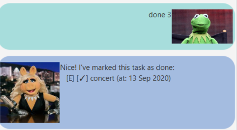
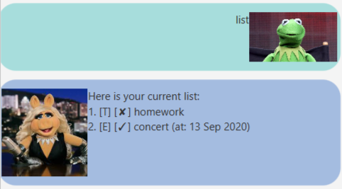
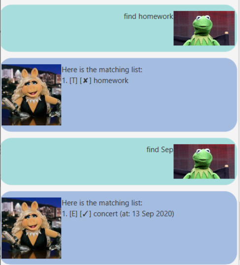

# **User Guide**
Duke is a chat bot that can help you manage your daily tasks.



## **Features** 

Duke is capable fo creating tasks, such as:

* ToDo
* Deadline
* Event

Duke can also help you manage these tasks via these commands:

* Done
* Delete
* List
* Find
* Tag
* Bye

## **Usage** 

Type your desired command into the text box of Duke. Duke will save your tasks into storage, and will load these tasks when starting up the app.

## **Commands**

### 1. Adding a ToDo task

**Usage:**
```
todo <description name>
```

Duke will add a todo task with the description name, and will also display the number of tasks in your current list.

**Example:** todo homework


### 2. Adding a Deadline task

**Usage:** 
```
deadline <description name> /by <date in YYYY-MM-DD format>
```

Duke will add a deadline task with the description name and a date it is due by, and will also display the number of tasks in your current list.

**Example:** deadline watch lecture /by 2020-09-20



### 3. Adding an Event task

**Usage:** 
```
event <description name> /at <date in YYYY-MM-DD format>
```

Duke will add an event task with the description name and a date it is held at, and will also display the number of tasks in your current list.

**Example:** event concert /at 2020-09-13



### 4. Mark task as done

**Usage:** 
```
done <task index in list>
```

Duke will mark the selected task as done. Task index refers to the position of the task in the list.
If task index is invalid, such as if it is 0 or smaller, Duke will return "No such task found!".

**Example:** done 3



### 5. Delete Task

**Usage:** 
```
delete <task index in list>
```

Duke will delete the selected task, and will return the number of tasks left in the list. Task index refers to the position of the task in the list.
If task index is invalid, such as if it is 0 or smaller, Duke will return "This task does not exist!".

**Example:** delete 2


### 6. List Current Tasks

**Usage:** 
```
list
```

Duke will list all current tasks that the user has inputted.



### 7. Find Tasks

**Usage:** 
```
find <keyword>
```

Duke will list all tasks that contains the keyword. Keyword can be found from the date, description or tags if the task has those properties. If no such tasks can be found, Duke will return
"No matching tasks!"

**Example:** find homework



### 8. Tag Task

**Usage:** 
```
tag <task index> <tag description>
```

Duke will find the task at the task index, and tag it with the tag description. Then, Duke will display that task together with its tag, and the tag is denoted with a #.

**Example:** tag 1 hard


### 9. Bye

**Usage:** 
```
bye
```

Duke will save all the tasks into storage, and close the program.


